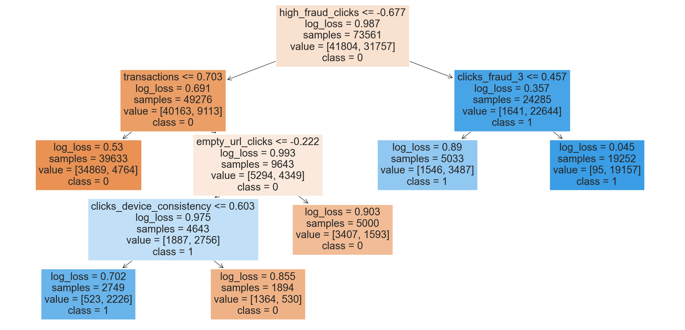
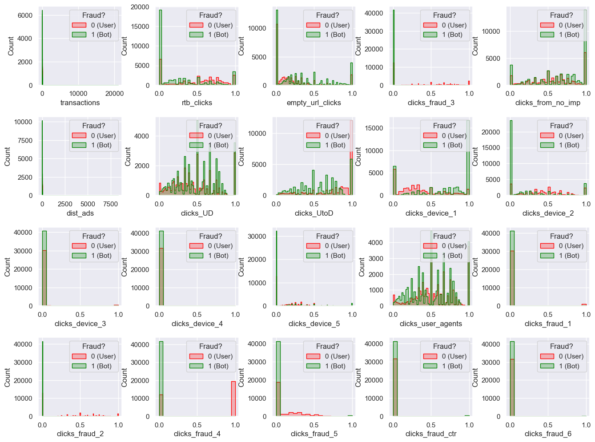
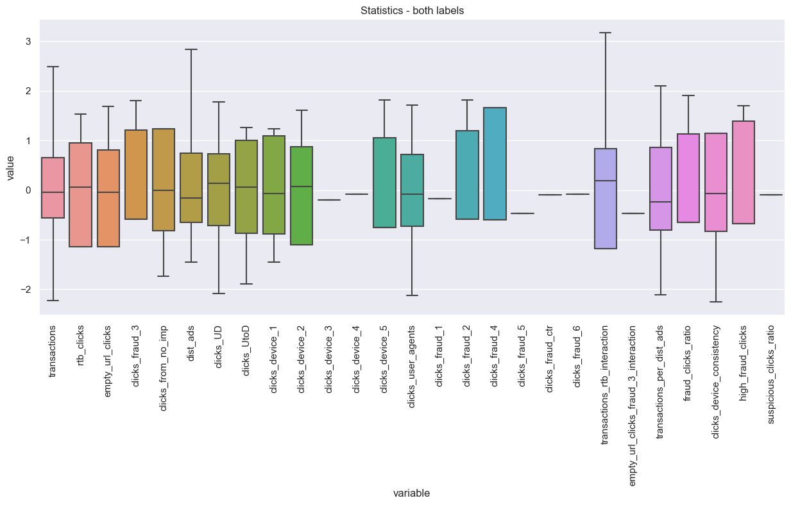

# FraudDetection_AdsCompany
**Project Aim**: create an ML model to predict whether users represented in the dataset by `IDs` are fraudulent (bots) or not.

## Task
This is a standard example of tasks we solve at *Ads Company*. You have a dataset of labelled data, and you need to create a model to predict labels. In this case, you would need to predict whether users represented by `IDs` are fraudulent (bots). Part of the work is already done for you – data is cleaned, summarised, feature importance is performed, and under-sampling technique already used to combat high class imbalance.

Your task is to build model and find appropriate model evaluation metric. Prepare and present `Jupyter` notebook going over short exploratory analysis of data, data modelling, prediction and evaluation. Share your feedback about data and the model – did it work for this dataset? Is anything missing, or you would have done differently?

## Data
In each file `label` and `ID` variables are provided: `label` indicates `1` if `ID` was fraudulent, `0` if not fraudulent; `ID` is an identifier of a user. On each file, for every `ID` the following features are calculated:

- `transactions` - number of transactions
- `rtb_clicks` - % share of RTB clicks
- `empty_url_clicks` - % share of clicks that had no url
- `clicks_fraud_3` - % share of clicks with fraud signal 3
- `clicks_from_no_imp` - % share of clicks that have no impression transaction id
- `dist_ads` - number of distinct banners
- `clicks_UD` - % share of unique domains
- `clicks_UtoD` - % share of unique landing domains
- `clicks_device_1` - % share of clicks from mobile
- `clicks_device_2` - % share of clicks from desktop
- `clicks_device_3` - % share of clicks from unknown device
- `clicks_device_4` - % share of clicks from TV
- `clicks_device_5` - % share of clicks from Tablet
- `clicks_user_agents` - % share of distinct user agents
- `clicks_fraud_1` - % share of clicks with fraud signal 1
- `clicks_fraud_2` - % share of clicks with fraud signal 2
- `clicks_fraud_4` - % share of clicks with fraud signal 4
- `clicks_fraud_5` - % share of clicks with fraud signal 5
- `clicks_fraud_ctr` - % share of clicks with high CTR
- `clicks_fraud_6` - % share of clicks with fraud signal 6

## Analysis plan
1. Extract the raw data
2. Data cleaning (duplicates)
3. Train-test splitting
4. Exploratory data analysis (EDA)
5. Features engineering
6. Preparing automated pipeline
7. Machine learning models training
8. Performance of best models
9. Final model storage

## Discussion
I have presented several machine learning models trained on the initial dataset. When tuning the model parameters I have decided to maximize the `recall` or `F1-score` metrics to take into account the scenario we want to detect all suspicious situations even then some of them are not (here `F1-score` is a kind of compromise to take into account the `precision` metric as well). I have decided for the two fastest algorithms, named `LogisticRegression` and `DecissionTreeClassifier` which have almot 90% score on both training and testing datasets (so no overfitting is present). They are also convenient because of explainability which might be important in some business scenarios. Both are working well on this balanced dataset (however, the potential solutions is case of imbalanced are also discussed).

The `ID` column is typically dropped when preparing data for machine learning because it serves as a unique identifier for each row and does not contain information relevant to predicting the target variable (in this case, whether a user is fraudulent). Including the `ID` column in the feature set can introduce noise and may negatively impact the performance of the model. The model might inadvertently learn patterns based on the unique `ID`s, which do not generalize well to unseen data. However, if there are specific scenarios or features derived from `ID` that could be useful, one should consider those carefully.

Having access to temporal acpects of the data, some temporal patters can be potentially found wchich might be crucial in detecting fraud. Also, it might be interesting to integrating the trained model with unsupervised anomaly detection methods (including clustering or Gaussian mixture models) to flag potential fraudulent activities that may not be captured by the supervised techniques. As mentioned through the analysis, several other approaches can be added, including dimensionality reduction or more sophisticated features engineering. It will be nice to check whether the binned or categorical variables changes the performance dramatically as they will be less nosiy. Morover, data quantization will increase the speed of computation.

